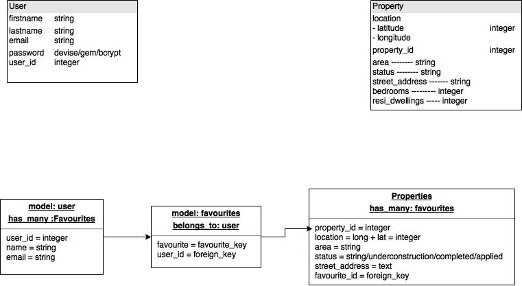
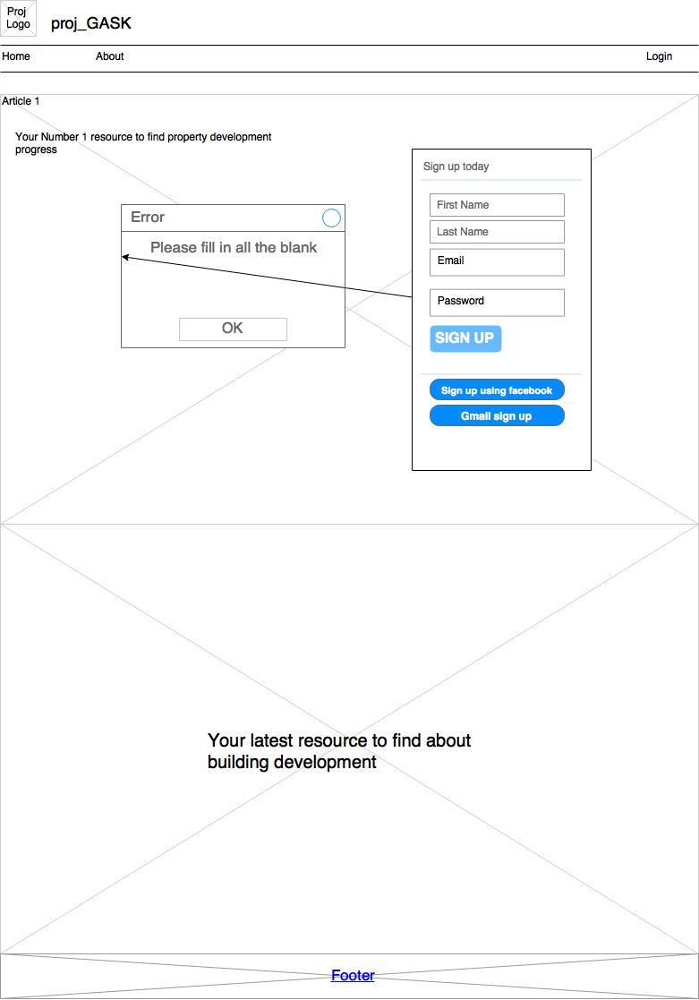
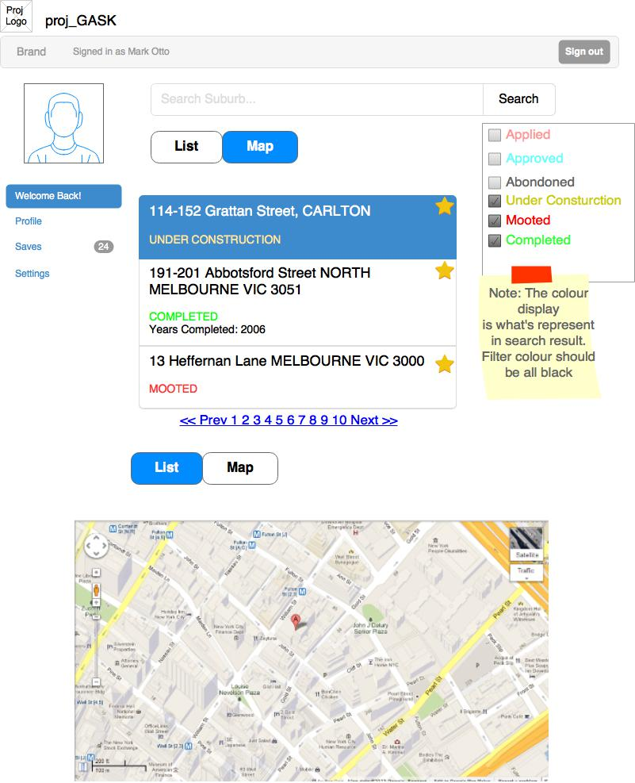
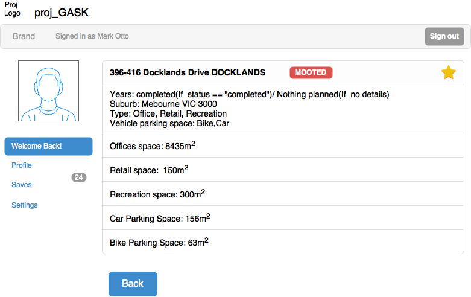
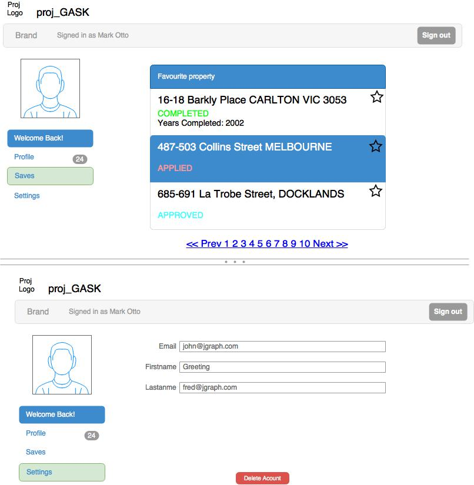

# MELBOURNE PLANNING APP

This site is currently hosted on Heroku [Link to Site](https://calm-beach-35487.herokuapp.com/).

## App Overview

The Melbourne property planning app allows users to view current property planning information for the City of Melbourne. As a buyer, investor or someone interested in looking at the future planning outlook for Melbourne, you can search via Suburb and Status and view in list or google map to view the locations.

## Data Sets

* City of Melbourne [Major Developments Planning Data](https://data.melbourne.vic.gov.au/Property-Planning/Major-development-projects-Development-Activity-Mo/gh7s-qda8).

* Google Maps API

* User Registration Data stored in a postGres Database

## Technical

###### Ruby Versions
* ruby 2.3.3

###### Gems/Frameworks
* Handlebars
* 'bcrypt', '~> 3.1.7'

###### Database
* postgresql

###### deployment
* Heroku

## ERD

## Wire Frames

## Challenges
* Team communication on GIT Merges and pulls.
* Clear decision making and solutioning.

## Items to complete
* navigation throughout the site (menu bar doesn't work)
* Facebook and Google Authentication.  This was a should have user story which we would have liked to finish for the MVP but we ran out of time.
